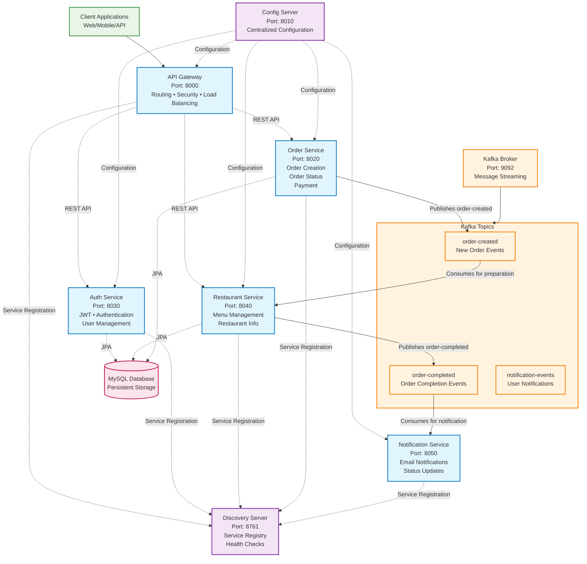
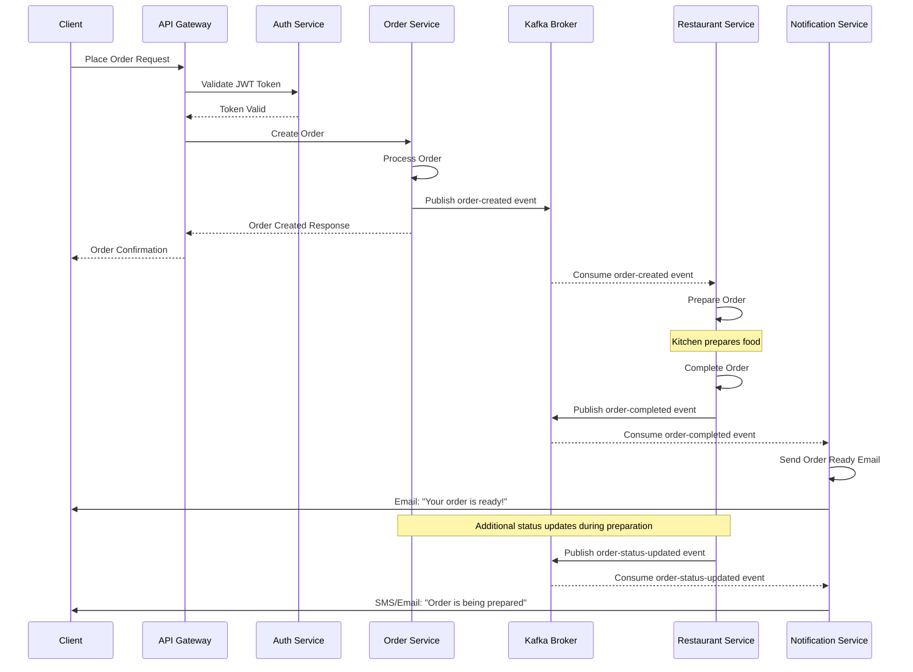
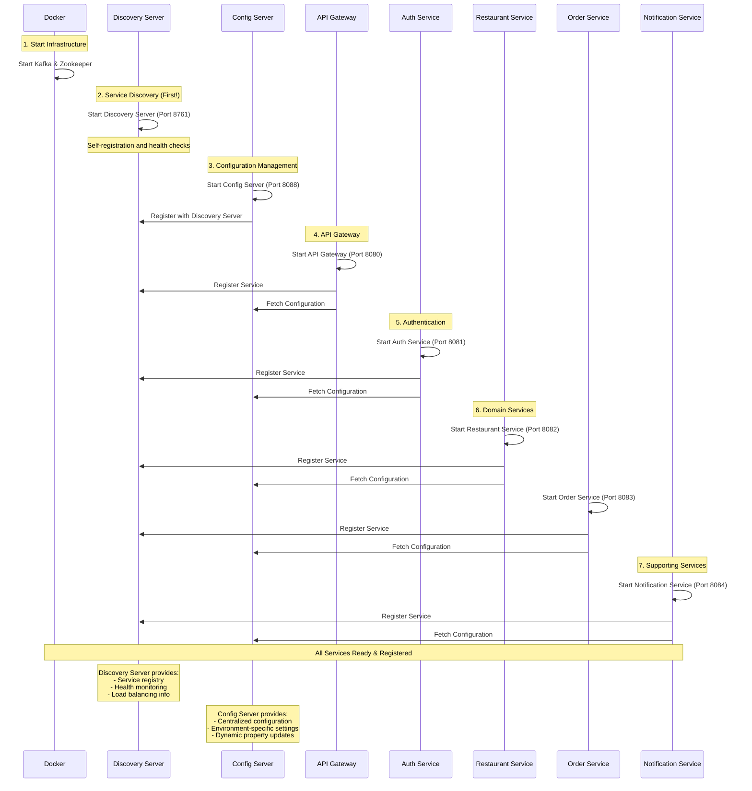
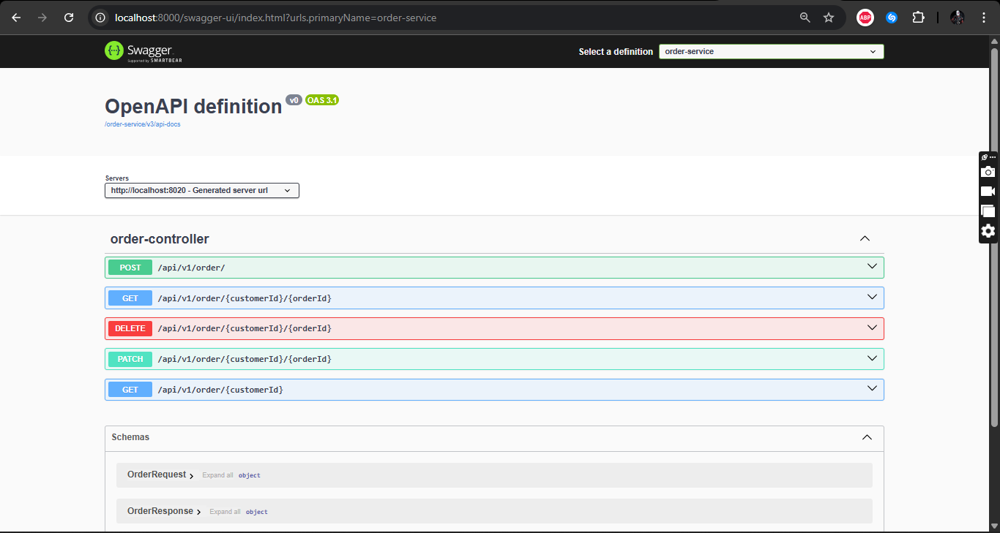
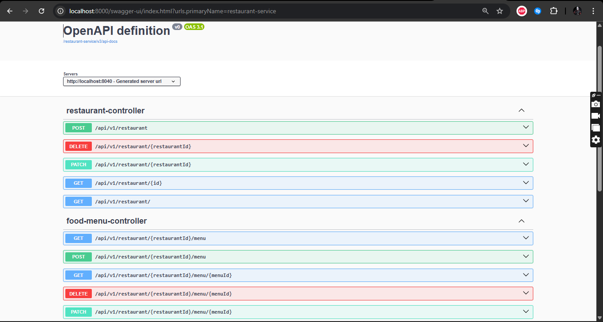

# ByteBiteRestaurants
A microservices application for ByteBites Restaurants

### ABOUT
ByteBite Restaurants is a microservices-based application designed to streamline the process of ordering food from various restaurants. It aims to provide a robust and scalable platform for managing restaurant data, handling food orders, and sending notifications.

The project leverages a modern tech stack centered around **Spring Boot** for building independent microservices, **Apache Kafka** for asynchronous communication and event-driven architecture, and **Docker** for containerization and simplified deployment. Key business features likely include user authentication, browsing restaurants and menus, placing orders, and receiving order updates or confirmations via notifications.


## **🏗 Architecture Overview**



- **`config-server`**: A centralized configuration server that provides configuration to all other microservices, enabling dynamic configuration updates without service restarts.
- **(Eureka)`discovery-server`**: Acts as a service registry where microservices register themselves upon startup and can be discovered by other services. This allows services to find and communicate with each other dynamically.
- **`api-gateway`**: Serves as the single entry point for all client requests. It handles routing requests to the appropriate microservices, performs load balancing, and can implement cross-cutting concerns like authentication and security.
- **`auth-service`**: Manages user authentication and authorization. It handles user registration, login, and token generation/validation to secure access to other services.
- **`restaurant-service`**: Manages all restaurant-related data, including restaurant details, food menus, and pricing.
- **`order-service`**: Responsible for handling the entire order lifecycle, from creating new orders to tracking their status and managing order details.
- **`notification-service`**: Sends various types of notifications to users, such as order confirmations, status updates, or promotional messages, typically via email or other channels.

#### Services primarily communicate in two ways:
- **Synchronous Communication (REST)**: Services like , , , and communicate synchronously using RESTful APIs, facilitated by the for service lookup. `api-gateway``auth-service``restaurant-service``order-service``discovery-server`
- **Asynchronous Communication (Kafka)**: **Apache Kafka** is used as a message broker for asynchronous, event-driven communication. This is crucial for decoupling services and handling events like order creation, where a single action might trigger multiple subsequent processes (e.g., sending a notification, preparing an order).



#### Sequence of Service Startups:


## Service Startup Order & Running the Project

#### Clone Repository
```bash
    git clone https://github.com/XzibiT-Collins/ByteBiteRestaurants
```

#### Start Kafka
```bash
    docker compose up -d
```

#### Run Discovery Server(Eureka)
```bash
    cd discovery-server
    
    mvn clean install -DskipTests #To skip tests
    
    mvn clean package # To build .jar file
    
    mvn spring-boot:run #Run service
```

#### Run Config Server
```bash
    cd config-server
    
    mvn clean install -DskipTests #To skip tests
    
    mvn clean package # To build .jar file
    
    mvn spring-boot:run #Run service
```

#### Run API gateway
```bash
    cd api-gateway
    
    mvn clean install -DskipTests #To skip tests
    
    mvn clean package # To build .jar file
    
    mvn spring-boot:run #Run service
```

#### Run Auth Service
```bash
    cd auth-service
    
    mvn clean install -DskipTests #To skip tests
    
    mvn clean package # To build .jar file
    
    mvn spring-boot:run #Run service
```

#### Run Restaurant Service
```bash
    cd restaurant-service
    
    mvn clean install -DskipTests #To skip tests
    
    mvn clean package # To build .jar file
    
    mvn spring-boot:run #Run service
```

#### Run Order Service
```bash
    cd order-service
    
    mvn clean install -DskipTests #To skip tests
    
    mvn clean package # To build .jar file
    
    mvn spring-boot:run #Run service
```

#### Run Notification Service
```bash
    cd notification-service
    
    mvn clean install -DskipTests #To skip tests
    
    mvn clean package # To build .jar file
    
    mvn spring-boot:run #Run service
```


```
bytebite/
├── 📁 api-gateway/
│   ├── src/
│   ├── pom.xml
│   └── README.md
│
├── 📁 auth-service/
│   ├── src/
│   ├── pom.xml
│   └── README.md
│
├── 📁 config-server/
│   ├── src/
│   ├── pom.xml
│   └── README.md
│
├── 📁 discovery-server/
│   ├── src/
│   ├── pom.xml
│   └── README.md
│
├── 📁 kafka-data/
│   ├── config/
│   └── scripts/
│
├── 📁 notification-service/
│   ├── src/
│   ├── pom.xml
│   └── README.md
│
├── 📁 order-service/
│   ├── src/
│   ├── pom.xml
│   └── README.md
│
├── 📁 restaurant-service/
│   ├── src/
│   ├── pom.xml
│   └── README.md
│
├── 📁 .gitignore
├── 📁 docker-compose.yml
├── 📁 LICENSE
├── 📁 pom.xml
└── 📁 README.md
```

### Swagger API endpoints
```text
    Swagger through API Gateway: http://localhost:8000/swagger-ui/index.html
```
Auth-Service Endpoints

Order-Service Endpoints

Restaurant-Service Endpoints
